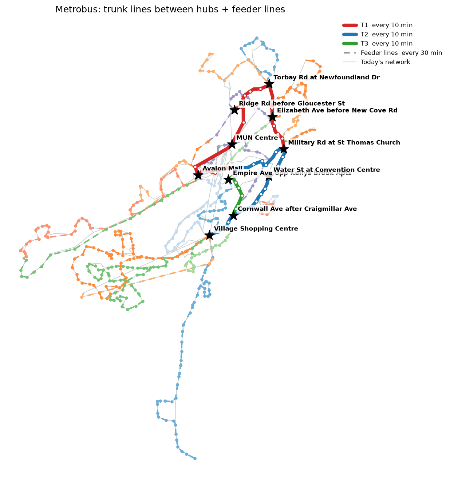

# metrobus-efficiency

Redesigns the Metrobus (St. John's, NL) network as **frequent trunk lines between major hubs** plus
**feeder lines** that carry today's neighbourhood routes to the nearest trunk stop. It's the same idea as the
TTC's subway-plus-buses, with buses on both layers.

It reads Metrobus's public GTFS schedule, finds the busiest places, connects them, turns the rest of today's
routes into feeders, then compares buses, service hours and cost against today. An editable web map lets
anyone change frequencies and stops and see what it costs.


<sub>10-hub plan from the current Metrobus feed. Full numbers in [results/summary.md](results/summary.md).</sub>

## Quick start

```bash
git clone https://github.com/ammar-15/metrobus-efficiency
cd metrobus-efficiency
python -m venv .venv && source .venv/bin/activate   # Windows: .venv\Scripts\activate
pip install -r requirements.txt
cp .env.example .env        # optional: tweak settings, add a map key
python -m metrobus_efficiency --open
```

The first run downloads the feed into `data/`. Results land in `output/`:

| File | What it is |
|---|---|
| `map.html` | Quick map: today's network (grey), trunks (solid), feeders (dashed), hubs (stars). The editable map is in `docs/`. |
| `plan.png` | Static picture of the plan for slides or a council submission. |
| `summary.md` | Today vs proposed: peak buses, weekday service hours, share of places with 15-min-or-better service. |
| `lines.csv` | Every proposed line: hubs, stops, km, running time, headway, buses needed. |
| `stops_plan.csv` | Every current stop and what happens to it: trunk stop, feeder stop, consolidated, or walk to a nearby stop. |
| `network.geojson` | The plan for QGIS, geojson.io, Felt, etc. |

## The editable web map

`docs/` is a small website (no build step) where anyone can play with the network:

- switch between **today's routes** and proposed plans with **6 to 12 hubs**
- change how often any line runs with the − / + buttons, or switch a line off
- tap a line, then tap any stop on the map to **add it to that line**, or remove stops from the list
- watch **buses on the road, weekday bus hours, yearly cost and frequent-service coverage** update against today
- **copy a link** that saves your exact version, to share or send to council

A GitHub Action (`.github/workflows/build-map.yml`) downloads the real feed on every push and every Monday,
runs the planner, and commits `docs/data/plan.json` and `results/`.

**Put it online:** in the repo, go to Settings → Pages, set *Source* to *Deploy from a branch*, branch `main`,
folder `/docs`, and save. The map will be at `https://ammar-15.github.io/metrobus-efficiency/`.

**Run it locally:**

```bash
python -m metrobus_efficiency --web     # writes docs/data/plan.json
python -m http.server -d docs 8000      # then open http://localhost:8000
```

### How the web map counts

- **Buses** = round-trip minutes × recovery time ÷ minutes between buses, rounded up, per line.
- **Bus hours** = service hours × round-trip minutes ÷ minutes between buses. Today's routes use their own
  first-to-last trip span and their midday frequency.
- **Yearly cost** scales weekday bus hours so today's routes match Metrobus's 156,004 revenue hours in 2025,
  at $146.52 per hour (2025 financial statements). Change the rate under *Assumptions*.
- **Coverage** = share of today's stops within 400 m of a stop with a bus every 15 minutes or better,
  all lines combined.
- **Adding a stop** inserts it where it adds the least detour; the extra distance at the line's average
  speed, plus 20 s for the stop itself, is added each way.

## How it works

1. **Load** the Metrobus GTFS feed and keep the busiest normal weekday.
2. **Merge** stop pairs on opposite sides of a street into one *place*, and build a street graph whose
   travel times come from today's schedule.
3. **Pick hubs**: score each place by buses through it, boosted for route variety (transfers happen there),
   sum scores within 250 m so a mall with many bays counts once, then take the top `N_HUBS` that are at least
   `HUB_MIN_SPACING_M` apart.
4. **Trunk lines**: connect hubs with a minimum spanning tree of direct street paths, add shortcuts where the
   tree forces a long detour, then cut the network into lines (longest first). Lines longer than
   `MAX_TRUNK_MIN` split at a middle hub; very short ones join a neighbour. Trunk stops are consolidated to
   ~`TRUNK_STOP_SPACING_M` apart, always keeping hubs and preferring the busiest stops.
5. **Feeder lines**: today's routes are cut where they reach trunk territory, and the parts that serve stops
   more than a short walk from a trunk become feeders, extended along the route to the nearest trunk stop so
   riders can transfer. Routes that go out one way and back another become one loop; pieces split by a short
   trunk stretch are joined. Streets, stops and running times all come from today's schedule.
6. **Compare**: buses = cycle time × layover ÷ headway; service hours = hours of buses in motion, the same basis
   as today's figure.

## Maps / API keys

No key is needed. The map uses OpenStreetMap tiles. For lines that follow real streets instead of
joining stops directly, get a free [OpenRouteService](https://openrouteservice.org/dev/#/signup) key and
set `ORS_API_KEY` in `.env`. Routed geometry is cached in `data/ors_cache.json`.

## Tuning

Everything is in `.env` (see `.env.example`), and the main knobs are also flags:

```bash
python -m metrobus_efficiency --hubs 8 --trunk-headway 12 --feeder-headway 30
python -m metrobus_efficiency --gtfs path/to/google_transit.zip   # use a feed you downloaded
python -m metrobus_efficiency --refresh                           # re-download the feed
```

Try a few settings and compare `output/summary.md`: the goal is more places with frequent service
for roughly today's number of buses.

## Limits

- Uses **schedules, not ridership**. Metrobus doesn't publish stop-level boardings; with them, hub
  scores and loop design would be much better.
- Travel times are today's scheduled times. No bus lanes or signal priority are assumed, so trunk times
  are conservative.
- "Peak buses today" counts trips running at the same moment, a lower bound on today's fleet.
- Feeders follow streets buses use today; new streets aren't considered.
- It's a sketch for discussion, not an operating plan.

## Tests

```bash
pytest -q
```

Tests run on a synthetic city (`tests/synthetic.py`), so they don't need internet access.

## Data

Metrobus GTFS: `http://www.metrobustransit.ca/google/google_transit.zip`, also mirrored by
[MobilityDatabase (mdb-758)](https://mobilitydatabase.org/feeds/gtfs/mdb-758).
