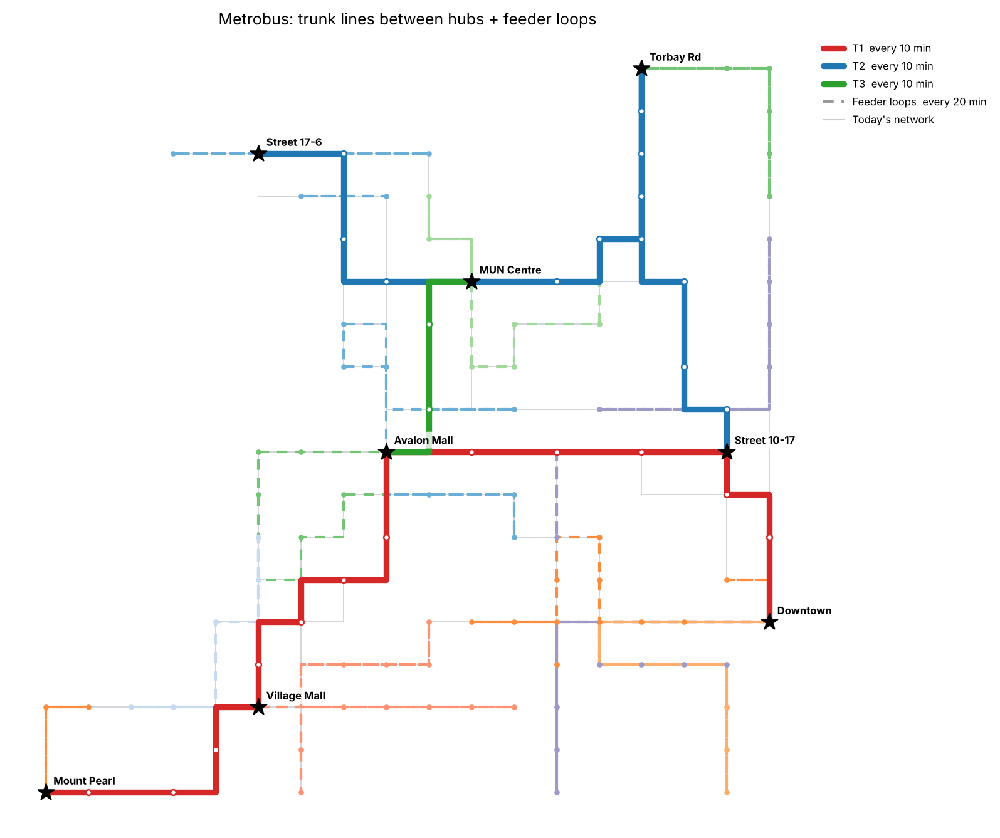

# metrobus-efficiency

Redesigns the Metrobus (St. John's, NL) network as **frequent trunk lines between major hubs** plus
**small feeder loops** that start and end at a hub — the same idea as the TTC's subway-plus-buses,
but with buses on both layers.

It reads Metrobus's public GTFS schedule, finds the busiest places, connects them, and redraws every other
stop into loops, then compares buses and service hours against today's schedule.


<sub>Example output on the built-in synthetic test city, not real Metrobus data.</sub>

## Quick start

```bash
git clone https://github.com/ammar-15/metrobus-efficiency
cd metrobus-efficiency
python -m venv .venv && source .venv/bin/activate   # Windows: .venv\Scripts\activate
pip install -r requirements.txt
cp .env.example .env        # optional: tweak settings, add a map key
python -m metrobus_efficiency --open
```

The first run downloads the feed into `data/`. Results land in `output/`:

| File | What it is |
|---|---|
| `map.html` | Interactive map: today's network (grey), trunks (solid), feeder loops (dashed), hubs (stars). Toggle layers top-right. |
| `plan.png` | Static picture of the plan for slides or a council submission. |
| `summary.md` | Today vs proposed: peak buses, weekday service hours, share of places with 15-min-or-better service. |
| `lines.csv` | Every proposed line: hubs, stops, km, running time, headway, buses needed. |
| `stops_plan.csv` | Every current stop and what happens to it: trunk stop, feeder stop, consolidated, or walk to a nearby stop. |
| `network.geojson` | The plan for QGIS, geojson.io, Felt, etc. |

## How it works

1. **Load** the Metrobus GTFS feed and keep the busiest normal weekday.
2. **Merge** stop pairs on opposite sides of a street into one *place*, and build a street graph whose
   travel times come from today's schedule.
3. **Pick hubs**: score each place by buses through it, boosted for route variety (transfers happen there),
   sum scores within 250 m so a mall with many bays counts once, then take the top `N_HUBS` that are at least
   `HUB_MIN_SPACING_M` apart.
4. **Trunk lines**: connect hubs with a minimum spanning tree of direct street paths, add shortcuts where the
   tree forces a long detour, then cut the network into lines (longest first). Lines longer than
   `MAX_TRUNK_MIN` split at a middle hub; very short ones join a neighbour. Trunk stops are consolidated to
   ~`TRUNK_STOP_SPACING_M` apart, always keeping hubs and preferring the busiest stops.
5. **Feeder loops**: every place more than a short walk from a trunk stop is assigned to the hub it reaches
   fastest. Around each hub, places are swept by compass direction into loops no longer than `MAX_LOOP_MIN`,
   and each loop is ordered with nearest-neighbour + 2-opt.
6. **Compare**: buses = cycle time × layover ÷ headway; service hours = hours of buses in motion, the same basis
   as today's figure.

## Maps / API keys

No key is needed. The map uses OpenStreetMap tiles. For lines that follow real streets instead of
joining stops directly, get a free [OpenRouteService](https://openrouteservice.org/dev/#/signup) key and
set `ORS_API_KEY` in `.env`. Routed geometry is cached in `data/ors_cache.json`.

## Tuning

Everything is in `.env` (see `.env.example`), and the main knobs are also flags:

```bash
python -m metrobus_efficiency --hubs 8 --trunk-headway 12 --feeder-headway 30
python -m metrobus_efficiency --gtfs path/to/google_transit.zip   # use a feed you downloaded
python -m metrobus_efficiency --refresh                           # re-download the feed
```

Try a few settings and compare `output/summary.md`: the goal is more places with frequent service
for roughly today's number of buses.

## Limits

- Uses **schedules, not ridership**. Metrobus doesn't publish stop-level boardings; with them, hub
  scores and loop design would be much better.
- Travel times are today's scheduled times. No bus lanes or signal priority are assumed, so trunk times
  are conservative.
- "Peak buses today" counts trips running at the same moment, a lower bound on today's fleet.
- Feeder loops follow streets buses use today; new streets aren't considered.
- It's a sketch for discussion, not an operating plan.

## Tests

```bash
pytest -q
```

Tests run on a synthetic city (`tests/synthetic.py`), so they don't need internet access.

## Data

Metrobus GTFS: `http://www.metrobustransit.ca/google/google_transit.zip`, also mirrored by
[MobilityDatabase (mdb-758)](https://mobilitydatabase.org/feeds/gtfs/mdb-758).
